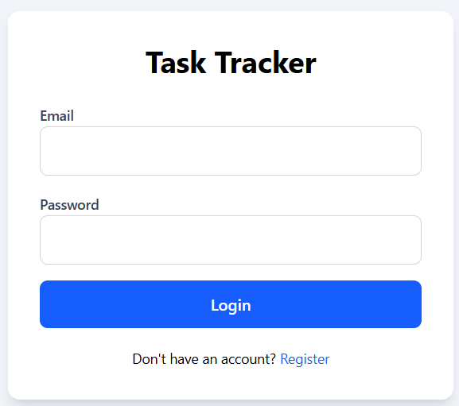
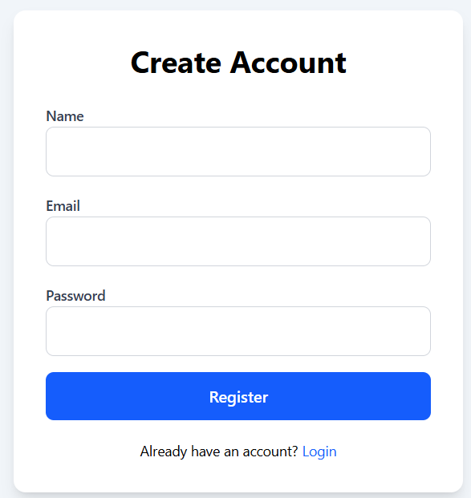
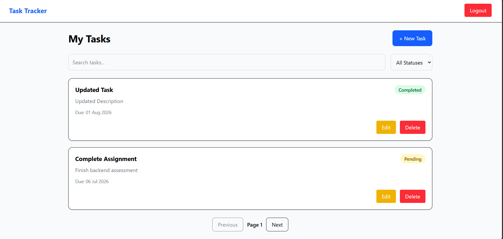
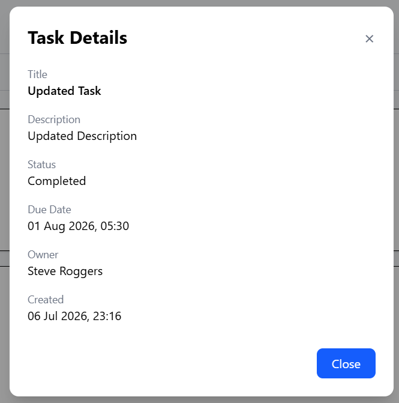

# TaskTracker API

A Task Tracker REST API built with **.NET 8 Clean Architecture**.

This project was developed as part of a Software Engineer (Backend Focused) take-home assignment.

---

# Features

## Backend

- JWT Authentication
- User Registration & Login
- Role-Based Access Control (User/Admin)
- Task CRUD
- Pagination
- Search & Filtering
- FluentValidation
- SignalR Real-Time Notifications
- Swagger
- PostgreSQL
- Repository Pattern
- Global Exception Middleware
- Unit Tests

## Frontend

- Login / Register
- Protected Routes
- Dashboard
- Task Details
- Create / Update / Delete Tasks
- Search
- Status Filtering
- Pagination
- Responsive UI
- Real-Time Updates using SignalR

---

# Tech Stack

## Backend

- .NET 8
- ASP.NET Core Web API
- Entity Framework Core
- PostgreSQL
- JWT Authentication
- SignalR
- FluentValidation
- xUnit
- Moq
- Swagger

## Frontend

- React 19
- TypeScript
- Vite
- Tailwind CSS
- Axios
- React Router
- React Toastify
- Microsoft SignalR Client

---

# Architecture

```
TaskTracker.API
TaskTracker.Application
TaskTracker.Infrastructure
TaskTracker.Tests
TaskTracker.Client
```

Built using Clean Architecture for the backend and React + TypeScript for the frontend.

---

# Getting Started

## Clone

# Backend Setup

```bash
git clone <repository-url>

cd TaskTracker
```

---

## Configure

Copy

```
appsettings.example.json
```

to

```
appsettings.json
```

Update

- PostgreSQL Connection String
- JWT Secret

---

## Database

```bash
dotnet ef database update \
--project TaskTracker.Infrastructure \
--startup-project TaskTracker.API
```

---

## Run

```bash
dotnet run --project TaskTracker.API
```

Swagger

```
https://localhost:xxxx/swagger
```

Replace **xxxx** with your local port.

---

# Frontend Setup

Navigate to the frontend project.

```bash
cd TaskTracker.Client
```

Install dependencies.

```bash
npm install
```

Start the development server.

```bash
npm run dev
```

The frontend will be available at:

```
http://localhost:5173
```

Ensure the backend API is running before starting the frontend.

---

# Frontend Environment

Update the API base URL inside:

```
TaskTracker.Client/src/api/axios.ts
```

Example:

```ts
baseURL: "http://localhost:5104/api";
```

If deploying the backend, update this URL to the deployed API endpoint.

---

# Authentication

Register

```
POST /api/auth/register
```

Login

```
POST /api/auth/login
```

Use the returned JWT token.

---

# API

## Tasks

```
POST /api/tasks

GET /api/tasks

GET /api/tasks/{id}

PUT /api/tasks/{id}

DELETE /api/tasks/{id}
```

Supports

- Pagination
- Search
- Status Filtering

---

# Real-Time

SignalR Hub

```
/hubs/tasks
```

Clients receive

- TaskCreated
- TaskUpdated
- TaskDeleted

---

# Testing

Run

```bash
dotnet test
```

Current Status

- 5 Unit Tests
- All Passing

---

# Postman

The repository contains

```
Postman/

TaskTracker.postman_collection.json

TaskTracker.postman_environment.json
```

---

# CI

GitHub Actions automatically

- Restore
- Build
- Test

on every Push and Pull Request.

---

# Future Improvements

- Docker Support
- Refresh Tokens
- Email Notifications
- Soft Delete
- Task Attachments
- Dark Mode
- Advanced Dashboard Analytics

---

# Screenshots

Login



register



Dashboard



Task Details



# License

For evaluation purposes only.
